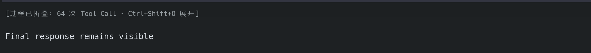
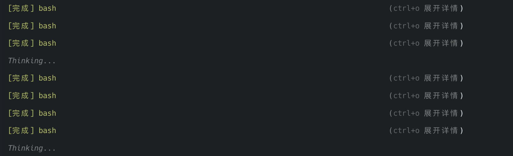

# Pi Compact Tools

Compact, collapsible built-in tool-call rendering for [Pi Coding Agent](https://github.com/badlogic/pi-mono).

中文说明见下方。[Pi Coding Agent](https://github.com/badlogic/pi-mono) 的内置工具调用紧凑显示与 turn 过程折叠扩展。

## Features

- Groups `bash`, `powershell`, `read`, `write`, `edit`, `grep`, `find`, and `ls` issued during one agent run into one concise count row, ordered by tool name's first use.
- Shows Thinking cycles plus completed, failed, and stable running tool counts; press `Ctrl+O` to expand every visible call's full arguments and output.
- Keeps the live count row at the latest tool-call position so earlier assistant text stays visually stable.
- Dims the count row and suppresses repeated thinking-only process messages in fullscreen mode while keeping intermediate assistant text visible.
- In fullscreen TUI mode, folds completed turn process rows while preserving the user prompt and final assistant response.
- Adds a marker before the final response with the total Tool Call count; press `Ctrl+Shift+O` to expand or re-fold completed processes.
- Does not change tool execution, tool validation, session files, or model context.

## Install

Pi packages execute arbitrary code. Review this repository before installing it.

```bash
pi install git:github.com/hxy91819/pi-compact-tools@v0.2.0
```

Turn folding requires fullscreen mode. Add this setting if it is not already configured:

```json
{
  "tuiMode": "fullscreen"
}
```

Restart Pi or run `/reload`. To update a pinned installation, install a newer tag explicitly; `pi update --extensions` preserves pinned Git refs.

## Usage

- `Ctrl+O`: expand or collapse detailed arguments and output for all visible tool calls.
- `Ctrl+Shift+O`: expand or collapse the process rows of all completed turns.

During a turn, calls across repeated reasoning/tool cycles remain visible as one dim summary row, for example:

```text
Thinking 3 次 · bash 1 完成 / 0 运行中 · edit 1 完成 / 1 运行中 (ctrl+o 详情)
```

Thinking-only messages that lead to tool calls are suppressed while the agent runs, but intermediate assistant text remains visible. Once the agent loop ends, the extension hides its tool calls, tool results, and intermediate assistant messages that invoked tools. Press `Ctrl+Shift+O` first to show the full process, then `Ctrl+O` for individual call details. The final response is preceded by a marker such as:

```text
[过程已折叠：3 次 Tool Call · Ctrl+Shift+O 展开]
```

Third-party tools retain their own compact rendering, but their process rows are folded with the rest of the completed turn.

## Screenshots

### Completed turn



### Expanded tool-call details



The command text in these local-session screenshots is intentionally removed; the images demonstrate only the extension's display behavior.

## Compatibility

Pi does not currently expose a public transcript-grouping API. Turn folding therefore uses a fullscreen display-component adapter. It is intentionally display-only, but may need an update after Pi changes its interactive TUI internals.

## Development

Requires Node.js 22.6 or newer.

```bash
npm ci
npm test
npm run typecheck
npm pack --dry-run
```

## Release

Releases are cut from tags. Bump `version` in `package.json`, commit, then tag with a matching `v` prefix:

```bash
npm version patch   # or minor / major
git push --follow-tags
```

Pushing `v*` runs [`.github/workflows/release.yml`](.github/workflows/release.yml), which fails the release unless all of the following pass:

1. The tag matches `package.json` version.
2. `npm run verify` — typecheck, unit tests, end-to-end TUI tests, dependency audit, package contents.
3. An install smoke test: `pi install git:github.com/hxy91819/pi-compact-tools@<tag>` into a throwaway config directory, then the same end-to-end suite runs against that installed copy.

Only then is the GitHub release created. Run `npm run verify` locally before tagging to get the same result without waiting on CI.

## Security

Do not commit credentials, session exports, transcripts, or private logs. Please report vulnerabilities privately as described in [SECURITY.md](SECURITY.md).

## License

[MIT](LICENSE)
